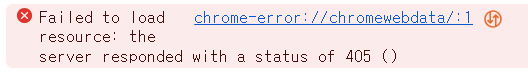

# 네이버 로그인 페이지 구현

---

### DOM 요소 선택
```
const idInput = document.getElementById('userEmail');
const pwInput = document.getElementById('userPassword');
const loginButton = document.querySelector('.btn-login');
```
getElementById와 querySelector를 사용하여 DOM에서 요소 선택
<br/>

### 아이디 유효성 검사
```
idInput.addEventListener('input', ()=>{
  if(!emailReg(idInput.value)){
    idInput.classList.add('is--invalid');
  }
  else{
    idInput.classList.remove('is--invalid');
  }
})
```
- 'idInput' 요소에 'input' 이벤트 리스너 등록
- 아이디를 입력할 때마다 'emailReg' 함수를 통해 유효성 검사
- 아이디가 이메일 형식이 아닐 경우 'is--invalid' 클래스를 추가하여 스타일 변경
<br/>

### 비밀번호 유효성 검사
```
pwInput.addEventListener('input', ()=>{
  if(!pwReg(pwInput.value)){
    pwInput.classList.add('is--invalid');
  }
  else{
    pwInput.classList.remove('is--invalid');
  }
})
```
- 'pwInput' 요소에 'input' 이벤트 리스너 등록
- 비밀번호를 입력할 때마다 'pwReg' 함수를 통해 유효성 검사
- 비밀번호가 유효한 형식이 아닐 경우 'is--invalid' 클래스를 추가하여 스타일 변경
<br/>

### 로그인 버튼 클릭 이벤트
```
loginButton.addEventListener('click', (event) => {
  event.preventDefault();

  if (idInput.value === user.id && pwInput.value === user.pw) {
    window.location.href = 'welcome.html';
  }
  else {
    alert('아이디 또는 비밀번호를 잘못 입력했습니다')
  }
});
```
- 'loginButton' 요소에 'click' 이벤트 리스너 등록
- 로그인 버튼이 클릭될 경우 event.preventDefault() 으로 이벤트의 기본 동작 취소
- 입력된 아이디와 비밀번호가 'user' 객체의 데이터와 일치할 경우 'welcome.html' 페이지로 이동, 일치하지 않을 경우 경고창 발생
<br/>

---
 #### ⭐ event.preventDefault()
 처음에는 event.preventDefault() 없이 코드를 작성했는데 에러가 발생
 
> 로그인 버튼 타입이 'submit'이기 때문에 기본 동작으로 폼이 제출되려고 시도
> event.preventDefault()를 사용하여 폼의 제출을 막고, 추가적인 로직 처리하도록 함